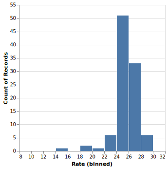
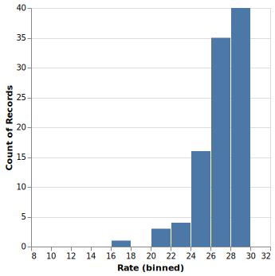
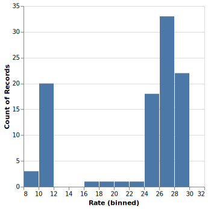
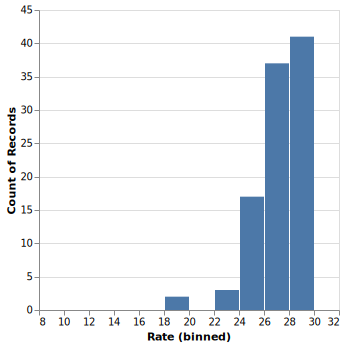
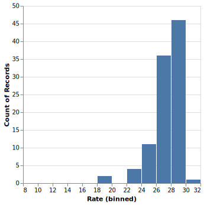

# Effect of `tracing` on throughput in boom

## Background

The `tracing` macros `info!`, `error!`, etc. create *events* that represent
moments in time. These events may be wrapped in *spans*---periods of time---to
provide context about what was happening in the program while the event was
created. The main way we create spans in boom is with the
`#[tracing::instrument]` attribute, which automatically defines a span for the
attributed function or method, but spans can be created explicitly, too. Events
emitted by the application are consumed by *subscribers*. Boom uses a single
subscriber, `tracing_subscriber::fmt`, that logs to the console. Creating spans
and events and then consuming them of course costs resources. Intuitively, the
more spans and events boom creates and consumes, the more time it will spend on
those activities. Because boom is meant to be a high-performance application,
we're naturally interested in knowing how much we "pay" for tracing when we
instrument our code and log at a particular level.

There are two ways to control how much time an application spends on tracing.
The first is setting the `RUST_LOG` environment variable (documented in our
readme), which configures the "interest" level of the subscriber and controls
what the `tracing` crate calls "static filtering" (despite the name, this doen't
have anything to do with what get compiled). This is best explained through an
example: consider an `info!` macro somewhere in the codebase. This macro
compiles to a "callsite" that is responsible for emitting INFO events. When this
callsite is first encountered at runtime, it goes through a registration process
that invo√es the subscriber if it's interested in getting these events. If
`RUST_LOG=info`, then the subscriber will respond that it wants INFO events from
this callsite. The callsite caches this response and sends along all events it
generates thereafter. A `debug!` macro elsewhere in the code gets its own
callsite and goes through the same registration process the first time it's
encountered at runtime. But in this case, the subscriber will respond that it's
not interested in DEBUG events from that callsite, and so that callsite won't
bother sending anything. (It's unclear to me whether the event is still created
even if there's no interest, or if `tracing` is smart enough to skip creating
the event when there are no interested subscribers.) The way this actually works
is much more detailed, and `tracing_subscriber` adds further layers of
complexity on top of `tracing`, but the main point is that registration happens
*at least once* for every event callsite in the codebase. Essentially, static
filtering controls which events are passed along to the subscriber. By limiting
events to only what we care about, we lessen the demand on the subscriber and
save resources in boom.

The second control is compile-time filtering through `tracing`'s features like
"release_max_level_info", "release_max_level_warn", etc. These feature flags
tell the compiler to only include spans and events up to and including the given
maximum verbosity level and to ignore all spans and events at higher levels. For
instance, if a crate is compiled with "release_max_level_info", then the
resulting binary will include the `info!` callsite from the previous example but
it will not include the `debug!` callsite. This means that whatever overhead is
associated with having a callsite present, e.g., callsite registration, can be
completely eliminated by compile-time filtering. Static filtering can still be
used, but it will only work up to the max level that's been compiled. This
technique lessens the demand on boom as a whole, not just its subscriber. The
downside to this approach is that enabling a verbosity level higher than the
current max requires compiling and deploying a new binary.

The ability to control the degree of tracing through a combination of static
filtering and compile-time filtering potentially has important implications for
tuning the performance of boom. Finding the best `tracing` feature flag and
`RUST_LOG` value requires measuring how these settings affect boom's overall
throughput.

## Design

The goal of this investigation was to measure throughput for different tracing
scenarios with the help of the script introduced in
https://github.com/boom-astro/boom/pull/165. What this script does is described
its help message, but briefly, it runs boom for a given survey and date and
measures the time elapsed between when the consumer first starts to when all of
the alerts are observed to be in the destination mongodb collection. The
throughput for that run, in alerts/s, is simply the number of alerts processed
divided by the measured time. Because runtimes can vary, the script supports
repeating the run for a specified number of iterations to build up a
distribution of throughput results.

I chose run the script under the following scenarios, collecting the resulting
throughput values from each one:

* "none-info": Regular release build (no compile-time filtering; "none") and
  logging at the default INFO level ("info"). This is the baseline case that
  represents the throughput for how we usually run boom.

* "none-debug": Same regular release build as "none-info", but logging at DEBUG
  instead of INFO. The subscriber had more events to process, therefore the
  throughput was expected to decrease relative to baseline. The was intended to
  help determine how much we pay for what we use.

* "info-debug": Logging at the DEBUG level again, but running a consumer and
  scheduler built with the `tracing` feature "release_max_level_info" enabled.
  With boom only able to log up to INFO, all DEBUG (and TRACE) events would be
  naturally filtered out regardless of the `RUST_LOG` setting. This eliminates
  all overhead associated with DEBUG/TRACE spans and events and was therefore
  expected to increase throughput relative to baseline. This was intented to
  help determine how much we pay for what we *don't* use unless we use
  compile-time filtering to remove it.

* "off-debug": Logging at DEBUG, but running a consumer and scheduler build with
  the "release_max_level_off" feature flag to disable tracing completely. This
  is the best way to see how fast boom could be without any logging at all,
  short of actually removing all instrumentation from the codebase. The level
  was set to DEBUG, but it could have been anything.

The following were held constant across all of the scenarios:

* I used the same docker setup throughout

* I used the same producer binary throughout

* Survey was "ztf"

* Date was "20240617". I considered using a night with more alerts, but found
  the runtimes were too long to make gathering statistics feasible. In
  particular, processing "20250122" took about 9 minutes on my laptop, while
  "20240617" only takes around 20 seconds. Throughputs for both dates were
  comparable, so using the smaller batch of alerts shouldn't make the results
  less valid.

* I Redirected the consumer and scheduler outputs to files. This is important
  because logging to console has its own overhead that I wasn't interested in
  measuring, and shunting the log data to files is faster. The goal was to
  determine how performance is impacted by `tracing` itself, not by how we
  output logs.

* I ran each experiment for 100 iterations. This number wasn't chosen for any
  deep reason, it just felt sensible. Each iteration takes around 20 seconds, so
  each experiment would take around an hour, which seemed like a long enough
  time to invest and hopefully get decent statistics.

## Scenario 1: "none-info"

I built the consumer and scheduler without any additional feature flags and then
copied them to `./env/none/bin` for safekeeping (I used `env` because we've told
git to ignore it):

```sh
cargo build --release
mkdir -p ./env/none/bin
cp ./target/release/{kafka_consumer,scheduler} ./env/none/bin/
```

Here's the command I ran for the baseline scenario "none-info":

```sh
./scripts/throughput_test.sh \
  --iterations 100 \
  --producer ./target/debug/kafka_producer \
  --consumer 'RUST_LOG=info,ort=error 2>./env/runs/throughput-20250714-20240617-none-info-consumer.log ./env/none/bin/kafka_consumer' \
  --scheduler 'RUST_LOG=info,ort=error 2>./env/runs/throughput-20250714-20240617-none-info-scheduler.log ./env/none/bin/scheduler' \
  --output ./env/runs/throughput-20250714-20240617-none-info.dat \
  -- ztf 20240617
```

I used the debug build of the producer due to an obscure bug in LLVM that
mysteriously affects http request headers in release builds only on intel macs
(see https://github.com/boom-astro/boom/issues/169). Normally, the `--producer`
option wouldn't be needed for this test.

The distribution of throughput values looked fairly normal, with an average (and
a median) throughput of around 25 alert/s and standard deviation around 2.



## Scenario 2: "none-debug"

Here is the command for the "none-debug" scenario:

```sh
./scripts/throughput_test.sh \
  --iterations 100 \
  --producer ./target/debug/kafka_producer \
  --consumer 'RUST_LOG=debug,ort=error 2>throughput-20250714-20240617-none-debug-consumer.log ./env/none/bin/kafka_consumer' \
  --scheduler 'RUST_LOG=debug,ort=error 2>throughput-20250714-20240617-none-debug-scheduler.log ./env/none/bin/scheduler' \
  --output throughput-20250714-20240617-none-debug.dat \
  -- ztf 20240617
```

There were a couple of surprises in these results:

1. The distribution was noticeably more skewed, weighted toward higher
   throughput values (negative skew). My first thought was that it's actually
   the *times* that are normally distributed rather than the rates, but the
   inverse of a normally-distributed variable would have a positive skew, not
   negative. Apparently the throughput distribution is something more
   complicated, ruling out using simple mean and standard deviation to
   characterized it.

2. The distribution shows that most of the runs in this scenario were actually
   *faster* than baseline, not slower as expected.

The median throughput was around 26 alert/s, technically more than 25 alert/s
for "none-info", but ultimately not that different considering the spread of the
data. And it turns out this makes sense: the scheduler log from "none-info" had
21 lines whereas the scheduler log from "none-debug" had 29 lines, only 8 lines
more. It's hard to imagine that having to process 8 more events would make any
difference to the subscriber. As far as I'm able to tell from the data I
collected, the difference in these two distributions has to be due to noise.



To see if I could get a clearer result, I decided to rerun the "none-debug"
scenario with `RUST_LOG=debug`, removing the restriction on events from `ort`.
The default value of `RUST_LOG` includes `ort=error` because `ort` normally
produces hundreds of INFO and DEBUG lines obscuring all events from boom itself
and we decided to supress them (see
https://github.com/boom-astro/boom/issues/181). Here, by lifting that
restriction on `ort`, the subscriber gets significantly more events to process
and should more clearly show the effect of static filtering (or lack thereof).

I named this variation on the "none-debug" scenario "none-debug2". Here is the
command that was used:

```sh
./scripts/throughput_test.sh \
  --iterations 100 \
  --producer ./target/debug/kafka_producer \
  --consumer 'RUST_LOG=debug 2>throughput-20250714-20240617-none-debug2-consumer.log ./env/none/bin/kafka_consumer' \
  --scheduler 'RUST_LOG=debug 2>throughput-20250714-20240617-none-debug2-scheduler.log ./env/none/bin/scheduler' \
  --output throughput-20250714-20240617-none-debug2.dat \
  -- ztf 20240617
```

The scheduler log in this case had 667 lines, more than 20x the events in
"none-debug". Surprisingly, this distribution was bimodal, with about 25% of the
values at very low throughputs around 10 alert/s. All of the other values were
distributed similar to those in "none-info" and "none-debug": median around 26
with most values somewhere between 24 and 30. So, ignoring the subset of low
throughput values (which was probably due to something else running on my system
creating noticeable resource contention), the results from this scenario were
practically the same as the previous two. Increasing the number of events didn't
seem to have any effect on throughput.



## Scenario 3: "info-debug"

I rebuilt the consumer and scheduler with the "release_max_level_info" feature
flag enabled for the `tracing` crate and then copied them to `./env/info/bin`:

```sh
cargo build --release  # with "release_max_level_info" enabled for tracing
mkdir -p ./env/info/bin
cp ./target/release/{kafka_consumer,scheduler} ./env/info/bin/
```

Here is the command for the "info-debug" scenario. I decided to keep
`RUST_LOG=debug` as in the "none-debug2" scenario to help make clear the effect
of compile-time filtering:

```sh
./scripts/throughput_test.sh \
  --iterations 100 \
  --producer ./target/debug/kafka_producer \
  --consumer 'RUST_LOG=debug 2>throughput-20250714-20240617-info-debug-consumer.log ./env/info/bin/kafka_consumer' \
  --scheduler 'RUST_LOG=debug 2>throughput-20250714-20240617-info-debug-scheduler.log ./env/info/bin/scheduler' \
  --output throughput-20250714-20240617-info-debug.dat \
  -- ztf 20240617
```

The distribution of throughputs from this scenario looked basically identical to
the distribution from "none-debug", and therefore also not that different from
"none-debug2" and "none-info". The scheduler log had 652 lines, which means
compile-time filtering only supressed 17 DEBUG events that were present in
"none-debug2". This lends further support to the emerging trend that boom
throughput has more to do with the machine it's running on and whatever other
processes may be running than with the so far immeasurable cost of instrumenting
the codebase with `tracing`.



## Scenario 4: "off-debug"

I rebuilt the consumer and scheduler again, this time with
"release_max_level_off". I then copied the binaries to `./env/off/bin`:

```sh
cargo build --release  # with "release_max_level_off" enabled for tracing
mkdir -p ./env/off/bin
cp ./target/release/{kafka_consumer,scheduler} ./env/off/bin/
```

Here is the command for the "off-debug" scenario:

```sh
./scripts/throughput_test.sh \
  --iterations 100 \
  --producer ./target/debug/kafka_producer \
  --consumer 'RUST_LOG=debug 2>throughput-20250714-20240617-off-debug-consumer.log ./env/off/bin/kafka_consumer' \
  --scheduler 'RUST_LOG=debug 2>throughput-20250714-20240617-off-debug-scheduler.log ./env/off/bin/scheduler' \
  --output throughput-20250714-20240617-off-debug.dat \
  -- ztf 20240617
```

If there's any measurable cost at all to tracing, this scenario should have
shown in. But again, the distribution of throughputs looked the same as the
other scnearios.



## Takeaway

I wasn't able to find any effect of `tracing` on the throughput of boom. My
impression is that we shouldn't be concerned that the current instrumentation is
negatively impacting performance, and we also shouldn't be worried about adding
more instrumentation. It's likely that the effect of `tracing` may not be
noticeable until we have on the order of one event per alert, or possibly more.

I would love to have this analysis repeated on a newer, faster machine. My
laptop is by no stretch state-of-the-art anymore and it's really showing its
age. It's entirely possible that the distributions of the different scenarios
presented here would be tighter and more distinct on more modern hardware.